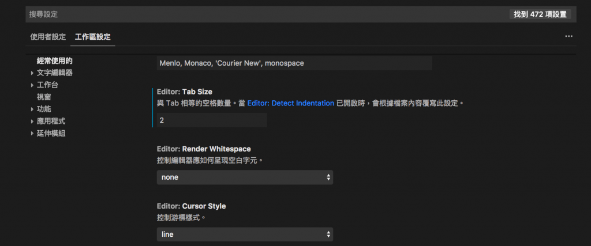

# 1111

asdad

---

sdadasadaddd

1. 測試1
2. 2
   1. asdasdd
      1. asdasdasd
         1. asdasdasdddddsdd
         2. $f(x) =y.$

1. 12315646

1. 1254164

---

$$
\begin{align}
f(x) = y.
\end{align}
$$

$$
\begin{align}
f(x) &= y. &  g(h) = \ell .  \\\\
\sin x &= y. &  \cos t = s.
\end{align}
$$

1. 125684

Ctrl 加上 A - Z ( 缺少 H、L、M、R、Y ) 的快捷鍵列表

快捷鍵 | 功能
----|---
Ctrl + A | 全選
Ctrl + B | 開啟 / 關閉檔案總管
Ctrl + C | 複製
Ctrl + D | 選取一段字詞
Ctrl + E | 搜尋游標位置的字詞
Ctrl + F | 開啟搜尋
Ctrl + G | 開啟搜尋
Ctrl + I | 選取游標位置的整行
Ctrl + J | 開啟問題顯示區
Ctrl + K | 要搭配其他指令才有作用
Ctrl + N | 開啟新檔案
Ctrl + O | 開啟...
Ctrl + P | 最近打開的文件
Ctrl + Q | 結束 VSCode
Ctrl + S | 儲存
Ctrl + T | 搜尋符號
Ctrl + U | 游標回上一位置
Ctrl + V | 搜尋符號
Ctrl + W | 關閉檔案
Ctrl + X | 剪下
Ctrl + Z | 回上一步

Extension | Author (truncated) | Version
----------|--------------------|--------
dotenv | mik | 1.0.1
python | ms- | 2018.9.2
debugger-for-chrome | msj | 4.10.2
vscode-yaml | red | 0.0.17
markdown-preview-enhanced | shd | 0.3.11
haml | vay | 1.0.1

